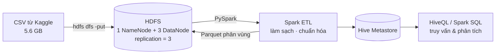

# ⚽ FIFA Big Data Pipeline — HDFS · Spark · Hive trên Docker

Đồ án môn **Big Data** — xây dựng pipeline lưu trữ và xử lý dữ liệu lớn cho bộ dữ liệu
[FIFA 23 Complete Player Dataset](https://www.kaggle.com/datasets/stefanoleone992/fifa-23-complete-player-dataset)
(FIFA 15 → 23, khoảng **10 triệu bản ghi**, file chính **5,6 GB**).

## 🏗️ Kiến trúc



| Giai đoạn (khung môn học) | Công cụ                        | Trạng thái         |
| ------------------------- | ------------------------------ | ------------------ |
| 3 – Lưu trữ dữ liệu       | HDFS (3 DataNode, nhân bản ×3) | ✅ Hoàn thành      |
| 4 – Xử lý dữ liệu         | Spark (PySpark), Hive          | ⏳ Đang làm        |
| 5 – Truy vấn & phân tích  | Hive / Spark SQL               | 🎯 Mở rộng nếu kịp |

## 📊 Kết quả giai đoạn 3 (HDFS)

- File `male_players.csv` (5,6 GB) được chia thành **42 block × 128 MB**, mỗi block **nhân bản 3 lần** trên 3 DataNode.
- `hdfs fsck`: **HEALTHY** — 0 block thiếu bản sao, 0 block lỗi, replication trung bình **3.0**.
- Demo chịu lỗi: tắt 1 DataNode → dữ liệu vẫn đọc đầy đủ (checksum không đổi); thêm node mới → HDFS tự nhân bản lại block bị thiếu.

> Ảnh minh chứng: xem thư mục [`docs/images`](docs/images).

## 🚀 Chạy trên máy của bạn (Windows)

**Yêu cầu:** Docker Desktop (WSL 2), RAM ≥ 16 GB khuyến nghị, ổ đĩa trống ≥ 40 GB.

1. Clone repo này về máy.
2. Tải dataset từ Kaggle, giải nén và đặt các file `.csv` vào `data/raw/`.
3. Mở Docker Desktop, chờ **Engine running**.
4. Lần đầu: `cd docker` → `docker compose pull` (tải image ~3–4 GB).
5. Bấm đúp **`scripts/start-cluster.bat`** để bật cụm.
6. Bấm đúp **`scripts/upload-to-hdfs.bat`** để đưa dữ liệu lên HDFS (chỉ làm 1 lần).
7. Trước khi tắt máy: **`scripts/stop-cluster.bat`**.

| Giao diện                    | Địa chỉ                              |
| ---------------------------- | ------------------------------------ |
| HDFS NameNode                | http://localhost:50070               |
| Jupyter + PySpark            | http://localhost:8889/?token=bigdata |
| Spark UI (khi đang chạy job) | http://localhost:4040                |

⚠️ Không chạy `docker compose down -v` — lệnh này **xóa toàn bộ dữ liệu HDFS**.

## 📁 Cấu trúc thư mục

```
├── docker/
│   ├── docker-compose.yml     # Cụm: NameNode, 3 DataNode (+1 dự phòng), Hive, Jupyter
│   └── hadoop-hive.env        # Cấu hình Hadoop/Hive
├── scripts/
│   ├── start-cluster.bat
│   ├── stop-cluster.bat
│   ├── upload-to-hdfs.bat
│   └── demo-fault-tolerance.bat
├── notebooks/                 # PySpark notebooks (giai đoạn 4)
├── docs/images/               # Ảnh minh chứng cho báo cáo
└── data/raw/                  # Dữ liệu CSV (không đưa lên GitHub)
```

Cây thư mục trên HDFS (phân vùng theo chuẩn Hive):

```
/fifa/raw/players/gender=male/male_players.csv
/fifa/raw/players/gender=female/female_players.csv
/fifa/raw/teams/gender={male,female}/...
/fifa/raw/coaches/gender={male,female}/...
/fifa/clean/      ← đầu ra Spark ETL
/fifa/curated/    ← dữ liệu sẵn sàng phân tích
```

## 👥 Thành viên

| Thành viên          | Vai trò                                          |
| ------------------- | ------------------------------------------------ |
| _Lê Hoàng Minh Huy_ | Hạ tầng Docker + HDFS (giai đoạn 3), trưởng nhóm |
| _Vũ Minh Nhật_      | Spark ETL — dữ liệu cầu thủ                      |
| _Lưu Thị Ngọc Hiếu_ | Spark ETL — bảng phụ, tối ưu & benchmark         |
| _Lê Đoan Quỳnh_     | Hive, trực quan hóa, báo cáo                     |
